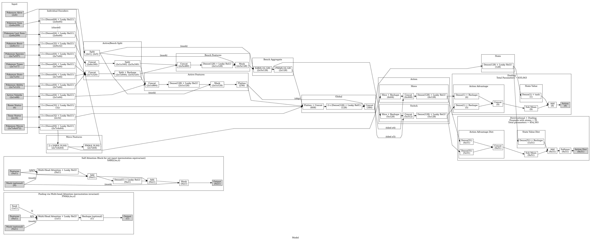

# Model

This folder defines the neural network model as well as the thread module for
serving it.

## Neural Network

The [model](model.ts) takes as input several tensors of various
[shapes](shapes.ts) that [encode](../psbot/handlers/battle/ai/encoder/) the
[battle state](../psbot/handlers/battle/state/) and processes them using
separate fully-connected layers. Move features are then fed through an attention
mechanism and pooled for aggregation along with the rest of the pokemon
features, which are then split between active and bench pokemon features. Active
features are concatenated and put through a hidden layer, while bench features
are fed through another attention mechanism and pooled, all while masking out
fainted pokemon for both active and bench. Lastly, individual attention-encoded
move and bench pokemon features, along with the aggregate of all the encoded
"global" input features, are then used to calculate the action and state value
outputs for the network using a
[dueling mechanism](https://arxiv.org/abs/1511.06581).

The attention and pooling mechanisms are inspired from the
[Set Transformer](https://arxiv.org/abs/1810.00825) paper, which adapts the
[original](https://arxiv.org/abs/1706.03762) attention mechanism for processing
unordered set-based data rather than natural language.

The model also supports [distributional](https://arxiv.org/abs/1707.06887)
reinforcemenet learning, where single action values, representing the
expectation (mean) of the Q-values, are each replaced with discrete probability
distributions.

## Worker

The [worker](worker/ModelWorker.ts) is the thread that manages all the
TensorFlow operations such as batch prediction and [training](../train/). For
predictions it exposes message-passing [ports](port/ModelPort.ts) which can be
used to implement [agents](../psbot/handlers/battle/agent/BattleAgent.ts) to
play or train with.
